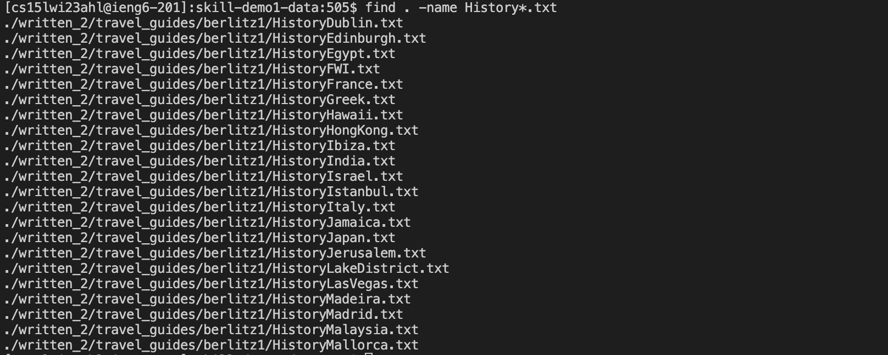
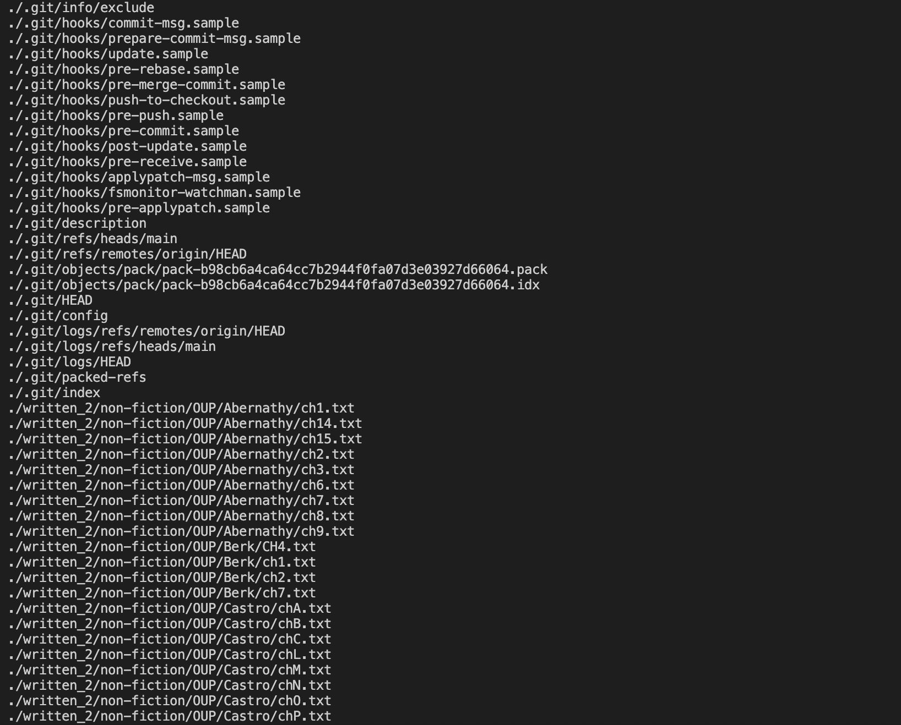
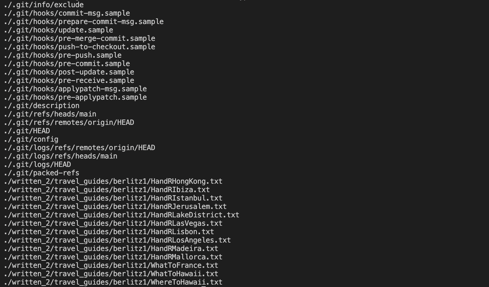
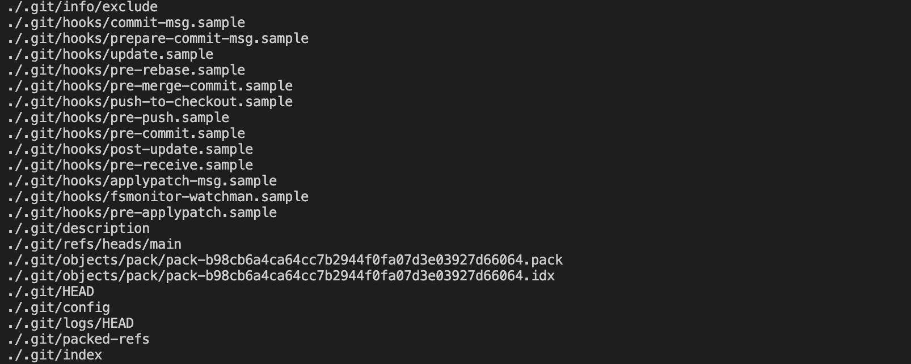

# Lab Report 3
## Researching Commands
##### Today we will mainly focus on the `find` command. 

* a) First of all, we need to set up our database. The database that we need to use is a github repository you can find : [Datbase you need to use](https://github.com/ucsd-cse15l-w23/skill-demo1-data).
* b) Next, we need to copy our database that type `git clone https://github.com/ucsd-cse15l-w23/skill-demo1-data` in your bash command line.

* c) After that, you need to `cd skill-demo1-data` and search the data from the tutorial of the dirtory of `written_2`.

##### Now we can try the four interesting command-line options of the `find` command !

### 1. `-name` option:

* The `-name` option of command `find` is used to search for files and directories in a given location.

Here, the `.` specifies the current directory as the starting point for the search.
#### * Example 1:

  The input of the command:
   
  
  The output of the command:
   
 

#### * Example 2:
  The input of the command:
   
  
  
  
  The output of the command:
   
   
   
  * There is a very useful command that is `-name`. If there are multiple files with the same name, the find command will return a list of all matching files. You can also use wildcards such as `*` in the pattern to match a broader range of file names. Just like the examples 1, the above command will search for all files with names that start with "History" and have a .txt extension.
  
  * Now, let's look at the example 2. the above command will search for all files with names that start with "What" and have a .txt extension.

Sources: I use the **ChatGPT** to find how the command is used, and I also looked at many examples of the man find command in terminal. 
  

### 2. `-type` option:

* The `-type` option of command `find` is used to specify the type of file or directory that you want to search for. In addition, the option takes a single character to represent the type of file or directory.

There are some common single characters to represent the type of file or directory:

-- f: Regular file

-- d: Directory

-- l: Symbolic link

-- b: Block device

-- c: Character device

Here, the `.` specifies the current directory as the starting point for the search.
#### * Example 1:
  The input of the command:
   
  
  The output of the command:
   

#### * Example 2:
  The input of the command:
   
  
  The output of the command:
   
   
   
   
  * There is a very useful command that is `-type` to find the specific type of file or directory that I want to search
  * So, just like the example 1, The `-type` option is followed by the argument `d`, which specifies that you want to search for directories. The output is all the directories.
  
  * Now, let's look at the example 2. the -type option is followed by the argument f, which specifies that you want to search for regular files. The output is all the regular files. There are too many files in it.
  
  
Sources: I use the **ChatGPT** to find how the command is used, and I also looked at many examples of the man find command in terminal. 

### 3. `-size` option:

* The `-size` option of command `find` is used to search the files based on their sizes, so we can use this option to find files that are larger or smaller than a specific size.

The -size option takes a size argument, which can be specified in bytes, kilobytes (KB), megabytes (MB), or gigabytes (GB). 

-- c: Size in bytes

-- k: Size in kilobytes (1024 bytes)

-- M: Size in megabytes (1024 kilobytes)

-- G: Size in gigabytes (1024 megabytes)

Here, the `.` specifies the current directory as the starting point for the search. 
The `-type` option is followed by the argument f, which shows we want to search for regular files.
#### * Example 1:
  The input of the command:
   
  
  The output of the command:
   

#### * Example 2:
  The input of the command:
   
  
  The output of the command:
   

  * There is a very useful command that is `-size`, which search the proper size that we want.
  * So, just like the example 1. `-size` is followed by the argument `+90k`, which means I want to search for files larger than 90 kilobytes in the current directory and its subdirectories.
  
  * Now, let's look at the example 2. `-size` is followed by the aguement `-5k`, which means I want to search for files smaller than 5 kilobytes in the current directory and its subdirectories.

Sources: I use the **ChatGPT** to find how the command is used, and I also looked at many examples of the man find command in terminal. 

### 4. `-maxdepth` command: 

* The `-maxdepth`option of command `find` is used to limit the depth of the search, which means it can limit limit the depth of the search to a specified number of levels.

Here, the `.` specifies the current directory as the starting point for the search. 

#### * Example 1:
  The input of the command:
   
  
  The output of the command:
   

#### * Example 2:
  The input of the command:
   
  
  The output of the command:
   

  * There is a very useful command that is `-mtime`,which can help us to find the limited depth of our search. If a very large value for `-maxdepth` can result in a long search that can consume a lot of system resources.
  * So, just like the example 1. The -maxdepth option is followed by the argument 4, which specifies that you want to limit the search to a depth of 4 levels. The -type option is followed by the argument f, which specifies that you want to search for regular files. 
  
  * Now, let's look at the example 2. The -maxdepth option is followed by the argument 2, which specifies that you want to limit the search to a depth of 2 levels(the current directory and its immediate subdirectories). The -type option is followed by the argument f, which specifies that you want to search for regular files. 

Sources: I use the **ChatGPT** to find how the command is used, and I also looked at many examples of the man find command in terminal. 

 
 
 
 
 

### That is all for the report !
